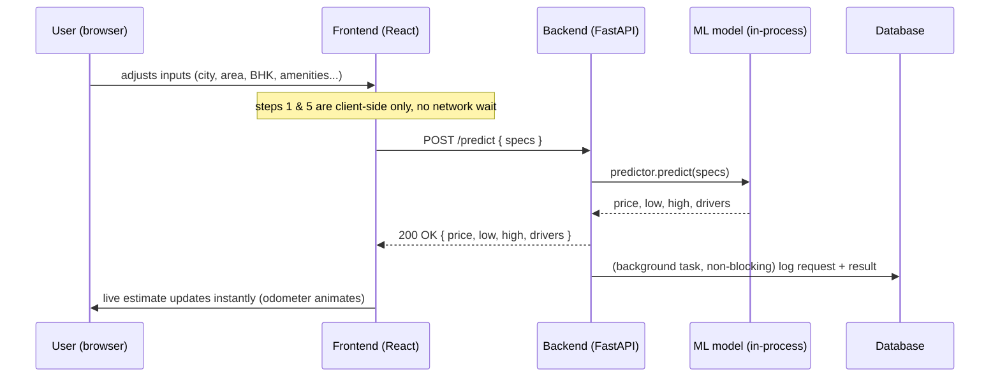
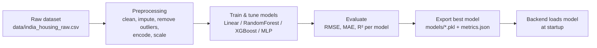

# Architecture Diagrams

## (a) Runtime request flow

Only the `POST /predict` round trip touches the network. The DB write happens
in a FastAPI `BackgroundTask` scheduled *after* the response is returned, so
it never adds latency to the user-facing prediction.

## (b) Offline training pipeline

Re-run `python train.py` any time the dataset changes — it's a repeatable
offline job, not a one-off script. The backend only ever reads the exported
`.pkl` files; it never trains anything itself.
