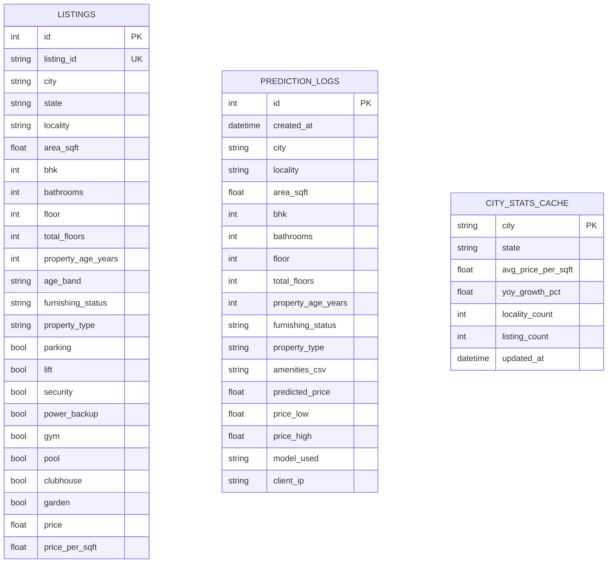

# ER Diagram — Kimat Database

## Notes

- **`listings`** — training/reference data, seeded from `ml/data/india_housing_raw.csv`
  via `seed_db.py` after `preprocessing.clean()` runs. Not written to at request time.
- **`prediction_logs`** — one row per `POST /predict` call, written by a
  `BackgroundTask` *after* the response is already sent (non-blocking).
- **`city_stats_cache`** — one row per city, refreshed by `seed_db.py`.
  `GET /city-stats` reads this instead of aggregating `listings` live on
  every request.
- No foreign keys between the three tables by design — they're independent
  facts (reference data, an audit log, a cache), not a normalized
  transactional schema.
- **Not yet implemented** (optional per the spec, "if login is added"): a
  `users` table and a `bookmarks` table (`user_id` FK → `users.id`,
  `locality` or `listing_id` reference). Add these only if/when auth ships —
  no other table needs to change to support it.
